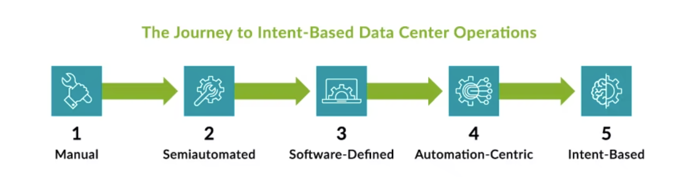
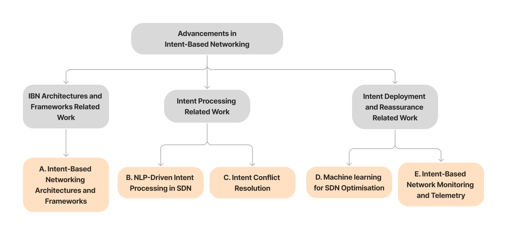
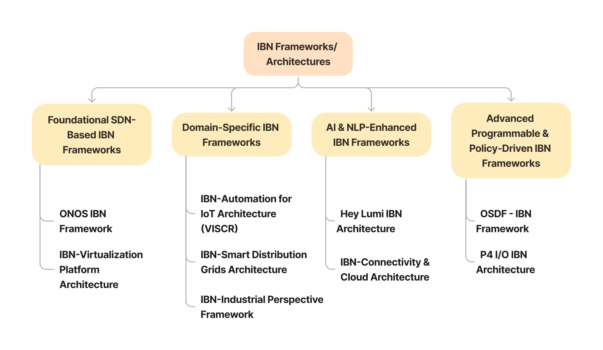

[comment]: # "This is the standard layout for the project, but you can clean this and use your own template"

# NLP Driven Intent-Based Networking layered architecture for Software Defined Networks

#### Team

- e19409, Udugamasooriya D.P., [email](mailto:e19409@eng.pdn.ac.lk)
- e19413, Viduranga G.G.N, [email](mailto:e19413@eng.pdn.ac.lk)
- e19446, Wijerathna I.M.K.D.I. , [email](mailto:e19446@eng.pdn.ac.lk)

#### Supervisors

- Dr. Suneth Namal Karunarathna, [email](mailto:namal@eng.pdn.ac.lk)

#### Table of content

1. [Abstract](#abstract)
2. [Related works](#related-works)
3. [Methodology](#methodology)
4. [Experiment Setup and Implementation](#experiment-setup-and-implementation)
5. [Results and Analysis](#results-and-analysis)
6. [Conclusion](#conclusion)
7. [Publications](#publications)
8. [Links](#links)

---

<!-- 
DELETE THIS SAMPLE before publishing to GitHub Pages !!!
This is a sample image, to show how to add images to your page. To learn more options, please refer [this](https://projects.ce.pdn.ac.lk/docs/faq/how-to-add-an-image/)
 
-->

## Abstract
Networking has undergone a significant transformation—from manually configured systems to Software-Defined Networking (SDN), and more recently, toward automation-centric architectures. SDN revolutionized network management by decoupling the control and data planes, enabling dynamic, programmable infrastructures. However, as network demands and business goals evolve, automation alone is no longer sufficient. This has led to the emergence of Intent-Based Networking (IBN), which allows administrators to define high-level business intents that are automatically translated into actionable network policies.

This project proposes an innovative NLP-driven intent-based networking architecture layered over SDN, aiming to streamline the translation of human-readable intents into machine-executable configurations. By integrating advanced Natural Language Processing (NLP) techniques with machine learning (ML) methods, the architecture tackles core challenges such as accurate intent interpretation, conflict resolution, and dynamic policy optimization through threshold tuning. Evaluated within a controlled SDN environment, the proposed framework aspires to enhance network management efficiency, improve operational performance, and accelerate the transition toward truly autonomous and intent-aware networking systems.

## Related works

As illustrated in the image above (source: [Juniper Networks](https://www.juniper.net/us/en/research-topics/what-is-intent-based-networking.html)), networking has come a long way—from fully manual configurations to semiautomated approaches, then to software-defined networking (SDN), and more recently toward automation-centric architectures. While SDN introduced centralized programmability and control, it still required explicit rules and lacked the ability to understand and adapt to changing business-level intents.

With networks becoming more dynamic and business requirements evolving rapidly, the limitations of SDN gave rise to the need for Intent-Based Networking (IBN)—a paradigm that allows administrators to express what they want the network to achieve, rather than how it should be done. This shift was driven by the demand for systems that can automatically translate high-level business goals into network policies and adapt in real-time.

Recent research has focused on advancing this next evolutionary stage in networking—IBN—by integrating Natural Language Processing (NLP), Large Language Models (LLMs), Machine Learning (ML), and Artificial Intelligence (AI). These technologies enhance the IBN frameworks by improving policy translation, real-time automation, and intelligent optimization of network behavior.

Early frameworks like ONOS introduced basic intent abstraction, allowing users to define high-level objectives. Over time, architectures such as the IBN-Virtualization Platform extended support for multi-tenant environments and introduced conflict resolution mechanisms. Other specialized systems like VISCR addressed IoT-specific intent management, while Hey Lumi introduced voice/NLP-based network configuration. The Open SDN Framework (OSDF) further enabled hybrid policies combining high-level and low-level rules.

To interpret and enforce user intents more effectively, various models now incorporate NLP techniques like Named Entity Recognition (NER) and intent classification, as well as LLMs for more human-like parsing and interaction. Some systems employ intent compilers to translate parsed intents into low-level flow rules, while others use gradient-based optimizers and policy learning agents to dynamically negotiate and deploy feasible configurations.

Moreover, AI-driven agents have been introduced for traffic classification, routing decisions, and delay prediction. Examples include using Deep Deterministic Policy Gradient (DDPG) algorithms and Artificial Neural Networks (ANNs) for intelligent, adaptive decision-making. These advancements reflect a broader movement toward truly autonomous networks.

Finally, to support monitoring and visibility in IBN systems, research has explored telemetry frameworks such as In-band Network Telemetry (INT), SDNMP, and ONOS-Aware, which extend traditional monitoring to match SDN and IBN's dynamic nature.

Together, these related works demonstrate a significant leap in how networks can self-operate, adapt, and align with business goals, marking the transition into fully intent-driven infrastructures.

## Methodology

#### System Overview
The proposed system integrates AI-driven intent recognition with SDN (Software Defined Networking) to create an intelligent and adaptive networking framework. The architecture interprets natural language user intents, processes them through multiple intelligent layers, and dynamically enforces them using SDN controllers and programmable middleboxes.

#### High-Level Design
To provide a comprehensive understanding of the proposed Intent-Based Networking (IBN) Architecture, the following high-level design diagram illustrates the key components and their interactions:

This architecture consists of multiple layers, each responsible for processing and enforcing user-defined intents within an SDN-driven environment. The data flow begins with natural language input and ends with policy enforcement and feedback loops, ensuring adaptability and optimization.

#### Module Breakdown
The proposed IBN Architecture comprises the following key modules:

1. **User Intent Layer**  
   - Serves as the entry point for defining network policies in natural language.
   - Preprocesses user input and forwards it to NLP layers.

2. **Entity Extraction Layer**  
   - Extracts relevant entities from user inputs using AI-driven techniques.
   - Identifies configuration deployment requests or network queries.
   - Converts extracted information into structured data for further processing.

3. **Structured Intent Generation Layer**  
   - Uses Large Language Models (LLMs) to map extracted entities to predefined network policy templates.
   - Generates structured policies in formats such as YAML or JSON for validation before enforcement.

4. **Policy Optimization Layer**  
   - Employs Machine Learning (ML) and Reinforcement Learning (RL) to optimize policy parameters dynamically.
   - Utilizes real-time telemetry data for continuous network efficiency improvements.

5. **Intent Enforcement Layer**  
   - Translates optimized policies into SDN-compatible rules, including flow rules, routing configurations, QoS policies, and ACL rules.
   - Pushes structured policies to the SDN controller for enforcement.

6. **Control Layer**  
   - Houses the SDN controller for executing intent-driven policies.
   - Collects real-time performance metrics through the Southbound Interface (SBI).
   - Provides telemetry feedback to ML/NLP layers for improved decision-making.

7. **Middlebox Layer**  
   - Fine-tunes network configurations within programmable middleboxes.
   - Resolves conflicts before final enforcement and feeds telemetry data back to ML/RL modules for continuous refinement.

The architecture incorporates multiple feedback loops, enabling continuous refinement of network policies and ensuring alignment with real-time network conditions.
**To achieve this, we follow the Design Science Research (DSR) methodology, which supports a mixed-method approach (qualitative and quantitative) and facilitates iterative improvements through interactive refinement.**

## Experiment Setup and Implementation

### Emulation Setup and Topologies
To validate the proposed system, a network emulation environment is built using SDN-controlled topologies with automated traffic generation.

#### Key Technologies Used
- **NLP Model (DeepSeek, GPT, LLaMA):** For Natural Language Understanding (NLU). DeepSeek is preferred due to its reasoning capabilities and open-source flexibility.
- **Few-Shot Learning for Intent Extraction:** Enables complex user intent interpretation with minimal training data.
- **Reinforcement Learning (RL) for Policy Tuning:** Optimizes policy selection based on feedback from the emulated network environment.
- **Mininet/Containernet/P4 for Emulation:**
  - Mininet and Containernet provide scalable virtualized environments.
  - P4 enables Inband Network Telemetry (INT) monitoring for real-time visibility into network performance.
- **SDN Controllers (ONOS, OpenDaylight):**
  - ONOS is preferred due to its robust API support.
  - OpenDaylight is considered for performance comparisons.

#### High-Level Implementation Plan

1. **User Intent Processing & Policy Generation**  
   - Users interact with a Chatbot UI and Monitoring Dashboard.
   - The NLP Server (DeepSeek/GPT/LLaMA) converts natural language prompts into structured network policies.
   - Policies are validated and stored in a backend server with a database.

2. **Intent Execution in Emulated SDN Topologies**  
   - The SDN Controllers (ONOS/OpenDaylight) enforce generated policies.
   - The system is tested on the following topologies:
     - **Collapsed Core:** Suitable for small networks with limited scalability.
     - **Spine-Leaf:** Used in large organizations for high availability and fault tolerance.
     - **Fat Tree:** Designed for high-performance computing environments and large scale complex networks.

3. **Real-Time Policy Adjustment Using ML & RL**  
   - A Machine Learning Engine predicts optimal QoS configurations based on telemetry feedback.
   - Reinforcement Learning dynamically refines policy parameters.

The implementation is designed to ensure scalability, adaptability, and efficiency in intent-based SDN environments.

## Results and Analysis

## Conclusion

## Publications
[//]: # "Note: Uncomment each once you uploaded the files to the repository"

<!-- 1. [Semester 7 report](./) -->
<!-- 2. [Semester 7 slides](./) -->
<!-- 3. [Semester 8 report](./) -->
<!-- 4. [Semester 8 slides](./) -->
<!-- 5. Author 1, Author 2 and Author 3 "Research paper title" (2021). [PDF](./). -->

## Links

[//]: # ( NOTE: EDIT THIS LINKS WITH YOUR REPO DETAILS )

- [Project Repository](https://github.com/cepdnaclk/e19-4yp-NLP-Driven-IBN-Layered-Architecture-for-SDNs)
- [Project Page](https://cepdnaclk.github.io/e19-4yp-NLP-Driven-IBN-Layered-Architecture-for-SDNs/)
- [Department of Computer Engineering](http://www.ce.pdn.ac.lk/)
- [University of Peradeniya](https://eng.pdn.ac.lk/)

[//]: # "Please refer this to learn more about Markdown syntax"
[//]: # "https://github.com/adam-p/markdown-here/wiki/Markdown-Cheatsheet"
